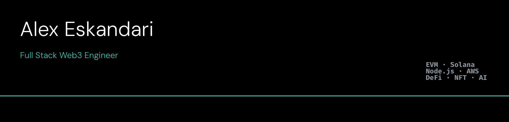

[](https://git.io/typing-svg)

> Building end-to-end blockchain products: React/Next.js frontends · Node.js backends · real-time data pipelines · cloud infra on AWS · EVM & Solana ecosystems

7 years shipping production-grade dApps. Led distributed teams of up to 8 engineers. Still writing the code daily.

---

## What I build

```
Frontend        →   React / Next.js / TypeScript / TailwindCSS
Backend         →   Node.js / NestJS / ElysiaJS / REST / GraphQL / WebSocket / BullMQ
Blockchain      →   Wagmi / Viem / Solidity / Anchor / The Graph / IPFS / RainbowKit
Wallets         →   Dynamic / Sequence / Privy / WalletConnect / SIWE — EVM + Solana
Databases       →   PostgreSQL / MongoDB / Redis / MySQL
Infrastructure  →   AWS (ECS, Lambda, RDS) / Docker / GitHub Actions / Vercel / Heroku
AI              →   Vercel AI SDK / LLM workflow automation / GitHub Apps
```

---

## Selected projects

### 🔬 Dr. Git — AI-powered code review (open source)
AI-powered GitHub App that automates code review at scale using LLM reasoning.  
Processes **1,000+ PRs/month** · reduces manual review time by **70%**  
`TypeScript` `GitHub Apps` `Vercel AI SDK` `Node.js`

> The core loop: receive PR diff → construct structured prompt → run LLM inference → post contextual review comments back to GitHub via the Apps API. Lightweight agentic workflow: sense → reason → act.

---

### 💬 Homa Chat — High-throughput messaging backend
Event-driven anonymous messaging system built for scale.  
**100,000+ concurrent users** · abuse detection preventing **8,000+ incidents/day**  
`ElysiaJS` `BullMQ` `Redis pub/sub` `PostgreSQL` `Prisma` `Docker` `Turborepo`

> Architecture: BullMQ job queues for async message processing, Redis pub/sub for real-time delivery, PostgreSQL for persistence, ElysiaJS API layer. Designed for horizontal scaling.

---

### 🏦 Altr — Web3 DeFi Lending Platform
Asset-backed lending dApp built end-to-end — wallet integration, smart contract UI, collateral flows.  
**2,000+ on-chain transactions** within first month post-launch  
`Next.js` `TypeScript` `Viem` `Apollo GraphQL` `EVM` `WalletConnect` `TailwindCSS`

---

### 🖼 Canto NFT Marketplace — Cold-start to $10k+ volume
Architected from MVP, reached **$10k+ NFT trading volume in 6 weeks** on a chain with under 50k active wallets.  
Real-time trading dashboards handling **10,000+ trades/day** via WebSockets and The Graph.  
`Next.js` `TypeScript` `The Graph` `IPFS` `Pinata` `Wagmi` `Viem`

---

### ⚙️ Luganodes — Enterprise Web3 Node Deployment
One-click blockchain node deployment platform. **10+ nodes provisioned in production.**  
Real-time dashboards for **1,000+ concurrent deployments/day**  
`Next.js` `TypeScript` `Apollo GraphQL` `The Graph` `Viem` `EVM` `WalletConnect`

---

## Production metrics across shipped work

| System | Scale |
|---|---|
| Anonymous messaging backend | 100,000+ concurrent users |
| AI code review automation | 1,000+ PRs/month, 70% time saved |
| NFT marketplace trading dashboards | 10,000+ trades/day |
| Web2 platform (StarryAI) | 100,000+ MAU |
| AWS microservices uptime | 99.9% |
| Cross-chain wallet connection failures reduced | 35% |
| Auth latency reduction via SIWE/NextAuth | 350ms |

---

## Experience timeline

```
2025 – 2026   Lead Full Stack Web3 Engineer @ ShowDown
              Multi-chain e-sports platform · EVM + Solana · Team of 5

2023 – 2025   Lead Full Stack Web3 Engineer @ NeoBase
              Web3 consultancy · NFT, DeFi, cross-chain dApps · Team of 8

2022          Lead Full Stack Engineer @ StarryAI
              AI-powered creative platform · 100k+ MAU

2021 – 2022   Full Stack Engineer @ Prestige
              Web3 analytics infra · AWS microservices · real-time data pipelines

2015 – 2020   Android · Backend · SEO — multiple client projects
```

---

## Tech stack

**Blockchain & Web3**


**Full Stack**


**Infrastructure & Data**


---

## Currently open to

- Senior / Lead Full Stack Web3 Engineer roles
- Full Stack Blockchain Engineer — DeFi, NFT, cross-chain infrastructure
- AI + Web3 engineering roles
- Remote · available across US / EU / Asia timezones · no visa sponsorship required (based in Finland)

📬 aesshoferi@gmail.com

---

<p float="left">
  <a href="https://github.com/meness/"></a>
</p>
